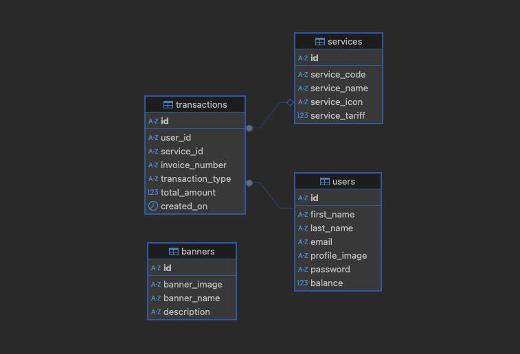

# 🧱 Nutech API

RESTful backend for Nutech Take Home Test project. Built with **Node.js + Express**, **MySQL**, and clean architecture (feature‑based modules).  
Supports membership, info, transaction, and balance modules. Auth, validation, error handling, and raw SQL support included.

---

## 📮 API Documentation

- 📘 [Postman Docs](https://documenter.getpostman.com/view/10035045/2sB34oCxix)


## 🌐 Live Demo

- 🔗 [https://nutech-api.example.com](https://nutech.up.railway.app/)  

---

## 📦 Tech Stack
- Node.js + Express.js
- MySQL
- Bcrypt for password hashing 
- JWT for authentication
- Express-validator for request validation
- Express-fileupload untuk file upload
- UUID for id generation
- Dotenv for environment variable management

---

## ⚙️ Setup & Run

```bash
# clone repo
git clone https://github.com/YUU-KUN/nutech.git
cd nutech

# install deps
npm install

# create .env file (see example below)
cp .env.example .env
# edit DB credentials, secret, NODE_ENV etc.

# import dump-nutech.sql to your DBMS

# start server
npm run dev
# or
node index.js
```

---

## ⚙️ Entity Relationship Diagram


