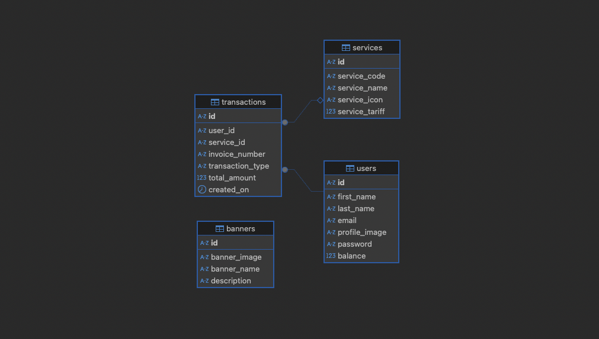

# 🧱 Nutech API

RESTful backend for Nutech Take Home Test project. Built with **Node.js + Express**, **MySQL**, and clean architecture (feature‑based modules).  
Supports membership, info, transaction, and balance modules. Auth, validation, error handling, and raw SQL support included.

---

## ⚙️ Setup & Run

```bash
# clone repo
git clone https://github.com/YUU-KUN/nutech.git
cd nutech

# install deps
npm install

# create .env file (see example below)
cp .env.example .env
# edit DB credentials, secret, NODE_ENV etc.

# import dump-nutech.sql to your DBMS

# start server
npm run dev
# or
node index.js

## ⚙️ ERD


